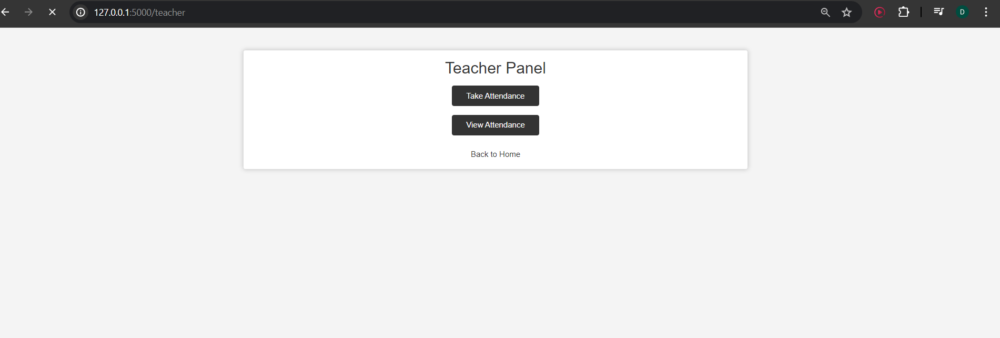

# Facial Recognition Based Attendance System

## Overview
This project is a facial recognition-based attendance system developed using Flask, OpenCV, and Dlib. The system allows teachers to track student attendance through facial recognition. Students can register their faces, and teachers can take attendance by capturing real-time video streams. The attendance data is stored in an SQLite database.

## Features
- **Student Registration**: Students can register their faces by providing their names. The system captures multiple images of the student's face and stores them in a directory.
- **Face Feature Extraction**: The system uses the `shape_predictor_68_face_landmarks.dat` model to extract facial features and store them in the backend.
- **Teacher Panel**: Teachers can take attendance by capturing video streams. The system recognizes faces using the `dlib_face_recognition_resnet_model_v1.dat` model and stores the attendance data (name and time) in the database.
- **Attendance Viewing**: Teachers can view the attendance records, showing which students were present on a selected date and the time they were recognized.

## Prerequisites
- Python 3.x
- Flask
- OpenCV
- Dlib
- SQLite

## Installation
1. Clone the repository:
    ```bash
    git clone https://github.com/your-username/facial-recognition-attendance-system.git
    cd facial-recognition-attendance-system
    ```

2. Create and activate a virtual environment:
    ```bash
    python -m venv env
    source env/bin/activate  # On Windows: env\Scripts\activate
    ```

3. Install the required dependencies:
    ```bash
    pip install -r requirements.txt
    ```

4. Download the required models:
    - `shape_predictor_68_face_landmarks.dat`
    - `dlib_face_recognition_resnet_model_v1.dat`
    
    Place the downloaded models in the project directory.

# Usage

1. **Run the Flask Application:**

    ```bash
    python app.py
    ```

2. **Welcome Page:**
   Navigate to [http://127.0.0.1:5000](http://127.0.0.1:5000) in your browser. You will see a welcome page with options to select "Student" or "Teacher."

3. **Student Registration:**
   - Click on "Student."
   - Enter the student's name and capture face photos.
   - The system will create a directory for the student and store the captured images.

4. **Teacher Panel:**
   - Click on "Teacher."
   - You will see two options: "Take Attendance" and "View Attendance."
   
   - **Take Attendance:**
     - Click on "Take Attendance."
     - The system will start capturing video streams and recognize faces.
     - Recognized faces will be stored in the database with the current time.

   - **View Attendance:**
     - Click on "View Attendance."
     - Select a date to view the attendance records.

# Screenshots

## Student Registration


## Attendance Taking


## Teacher Panel


## Attendance Data Table


# Contributing

Contributions are welcome! Please fork this repository and submit pull requests for any features or improvements.

# License

This project is licensed under the MIT License.
